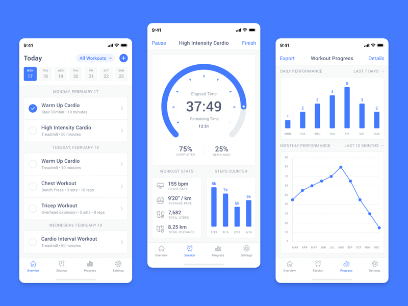

#  Workout App

[How to convert a hex color to a UIColor](https://www.hackingwithswift.com/example-code/uicolor/how-to-convert-a-hex-color-to-a-uicolor)
[YouTube](https://www.youtube.com/watch?v=yt9V_Y_LtSM&list=PLVWlAvWX1o97Rz-1noMOdT3SZHhVaK8YQ)

[Ссылка на дизайн из Sketch App Sources](https://www.sketchappsources.com/free-source/4298-workout-tracking-app-sketch-freebie-resource.html)
